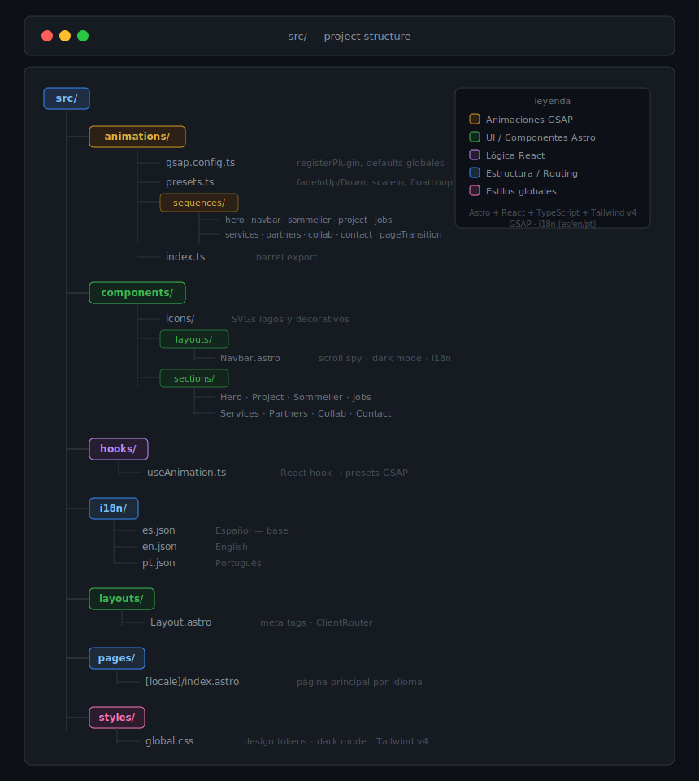

# En Una Copa
## Private Wine Tasting Experience

> Portfolio digital multilenguaje para **Camilo Chávez**, Sommelier Internacional certificado WSET 3.
> Diseñado y desarrollado por [Rodolfo Fuentealba](https://rodfuentealba.com).

Experiencia web que reemplaza el PDF estático por un portfolio digital inmersivo — diferencial real dentro del ecosistema sommelier en Chile y Latinoamérica.

El concepto **"En Una Copa"** es geográficamente escalable: _Chile en una Copa_, _El Norte en una Copa_, _Italia en una Copa_.

---

## Stack

| Tecnología | Rol |
|---|---|
| [Astro 6](https://astro.build) | Framework principal + routing i18n nativo |
| [React 19](https://react.dev) | Componentes interactivos (islands) |
| [Tailwind CSS 4](https://tailwindcss.com) | Sistema visual |
| [GSAP 3](https://gsap.com) | Animaciones (ScrollTrigger, MotionPathPlugin) |
| [TypeScript](https://www.typescriptlang.org) | Tipado estático |

**Tipografías:** Allison (display) · Alexandria (sans) · Faustina (serif) — Google Fonts

---

## Estructura

<picture>
  <source media="(prefers-color-scheme: dark)" srcset="./project-structure.svg">
  
</picture>

---

## Multilenguaje

Sitio con i18n nativo de Astro 6. Cambio de idioma via `data-astro-reload` (recarga completa para evitar conflictos con GSAP).

| Idioma | Ruta | Estado |
|---|---|---|
| Español | `/es` | ✅ Completo |
| English | `/en` | ✅ Completo |
| Português | `/pt` | ✅ Completo |

---

## Desarrollo local

```bash
git clone https://github.com/rodfuentealba/enunacopa.git
cd enunacopa
npm install
npm run dev      # → http://localhost:4321
```

**Node:** `>=22.12.0`

```bash
npm run build    # → ./dist/
npm run preview  # Preview local del build
```

---

## Roadmap

### `main` — Base + Animaciones ✅
- [x] Astro 6 + React + Tailwind + GSAP instalados
- [x] i18n configurado (es / en / pt)
- [x] Arquitectura de animaciones (`src/animations/`)
- [x] Navbar con scroll spy, dark mode, selector de idioma, entrada GSAP
- [x] Hero con entrada desde abajo
- [x] Project con columnas desde izquierda/derecha
- [x] Sommelier con parallax, uvas flotantes, entry/exit
- [x] Jobs con clip-path reveal + staggered logos
- [x] Services con tarjetas desde izquierda
- [x] Partners con contenido desde derecha
- [x] Collab con fade desde arriba/abajo
- [x] Contact con imagen, brand scale, contenido desde derecha
- [x] Fade out en scroll up para todas las secciones
- [x] Hook React `useAnimation` para islands
- [x] Language switch con `data-astro-reload`
- [x] Optimización de imágenes a WebP + video H.265 (—69% peso total)

### Próximas iteraciones
- [ ] Loader animado con transición GSAP
- [ ] Testing cross-browser

---

## Autor

**Rodolfo Fuentealba** — Diseño y desarrollo web
[rodfuentealba.com](https://rodfuentealba.com) · [GitHub](https://github.com/rodfuentealba)

## Cliente

**Camilo Chávez** — Sommelier Internacional · WSET 3
[LinkedIn](https://www.linkedin.com/in/camilo-ch%C3%A1vez-ram%C3%ADrez-2b060a94/) · Instagram: [@camilocram](https://instagram.com/camilocram)

---

© 2026 Rodolfo Fuentealba para Camilo Chávez. Todos los derechos reservados.
